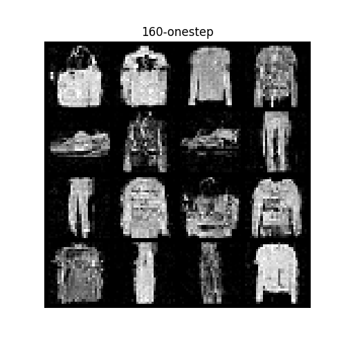

# Consistency Model with Diffusion Transformer

A minimal PyTorch implementation of consistency models using diffusion transformers.

## Overview

This project implements consistency models with diffusion transformers. For more information, see [this article](https://zhuanlan.zhihu.com/p/1979687312045654245/).

## Installation

Follow the [DiT installation instructions](https://github.com/facebookresearch/DiT) to install the necessary dependencies.

## Usage

Run the following command to execute the code:

```bash
python main.py
```

**Note:** By default, learned v is not used.

Generated samples are saved in the `output` folder. We provide some pre-generated image samples under the `result` folder. 



## Model Architecture

This implementation adopts the main architecture from [DiT](https://github.com/facebookresearch/DiT/blob/main/models.py) with minimal modifications:

### Key Changes

- **Removed:** `learn_sigma` configuration (used in older diffusion models to predict noise variance)
- **Added:** `learn_v` configuration

### Model Outputs

The model behavior depends on the `learn_v` parameter:

- **When `learn_v = False`:** The model outputs only `w`
- **When `learn_v = True`:** The model outputs both `w` and `v`

Where:
- **`v`:** The normal ODE target (e.g., `x₁ - x₀` in flow matching)
- **`w`:** The vector field such that `f(t)w(x_t, t) = ∫₀ᵗ v`

## References

- [Diffusion Transformer (DiT)](https://github.com/facebookresearch/DiT)
- [Implementation Details](https://zhuanlan.zhihu.com/p/1979687312045654245/)